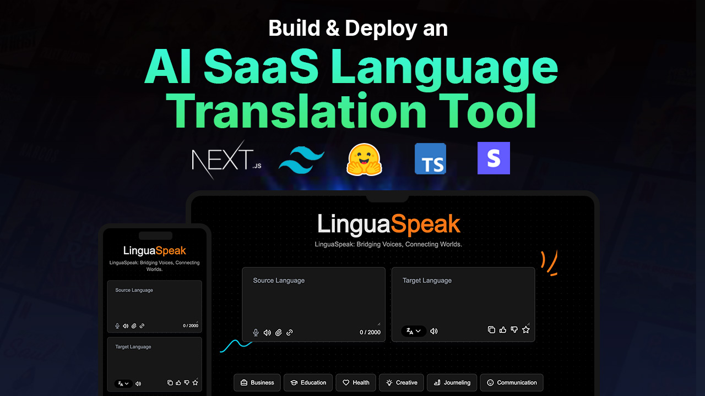

<div align="center">
  <br />
    <a href="https://youtu.be/dGHFV_RMGag" target="_blank">
      
    </a>
  
  <br />

  <div>
    
    
    
  </div>

  <h3 align="center">LinguaSpeak</h3>

   <div align="center">
     Build this project step by step with our detailed tutorial on <a href="https://www.youtube.com/@albertmends" target="_blank"><b>Your YouTube Channel</b></a>. Join the community!
    </div>
</div>

## 📋 <a name="table">Table of Contents</a>

1. 🤖 [Introduction](#introduction)
2. ⚙️ [Tech Stack](#tech-stack)
3. 🔋 [Features](#features)
4. 🤸 [Quick Start](#quick-start)
5. 🕸️ [Assets & Code](#snippets)
6. 🚀 [More](#more)

## 🚨 Tutorial

This repository contains the code corresponding to an in-depth tutorial available on our YouTube channel, <a href="https://www.youtube.com/@albertmends/videos" target="_blank"><b>Code with Albert</b></a>.

If you prefer visual learning, this is the perfect resource for you. Follow our tutorial to learn how to build projects like these step-by-step in a beginner-friendly manner!

## <a name="introduction">🤖 Introduction</a>

Built with the latest Next.js and TypeScript, LinguaSpeak is an advanced voice translation tool. It allows users to speak into the microphone, translate the spoken text to another language, and playback the translation. This project is perfect for those looking to learn how to integrate speech recognition and translation APIs into a Next.js application.

If you're getting started and need assistance or face any bugs, join our active Discord community. It's a place where people help each other out.

<a href="https://discord.com/channels/1221368900579754074/1221368901162631243" target="_blank"></a>

## <a name="tech-stack">⚙️ Tech Stack</a>

- Next.js
- TypeScript
- OpenAI API
- React Speech Recognition
- Tailwind CSS

## <a name="features">🔋 Features</a>

👉 **Speech Recognition**: Converts spoken words into text using the Web Speech API.

👉 **Text Translation**: Translates the recognized text into a selected target language using OpenAI's GPT-4 model.

👉 **Audio Playback**: Converts translated text back into speech using the Web Speech API's speech synthesis.

👉 **File Upload**: Reads and translates text from uploaded files, including RTF to plain text conversion.

👉 **Link Content Fetching**: Fetches and translates text content from provided URLs.

👉 **Language Selection**: Allows users to select target languages for translation.

👉 **Copy to Clipboard**: Copies the translated text to the clipboard.

👉 **Like, Dislike, and Favorite**: Provides user interaction features for translations.

👉 **Responsive Design**: Ensures a seamless experience across different devices.

## <a name="quick-start">🤸 Quick Start</a>

Follow these steps to set up the project locally on your machine.

**Prerequisites**

Make sure you have the following installed on your machine:

- [Git](https://git-scm.com/)
- [Node.js](https://nodejs.org/en)
- [npm](https://www.npmjs.com/) (Node Package Manager)

**Cloning the Repository**

```bash
git clone https://github.com/mendsalbert/lingua-speak.git
cd linguaspeak
```

**Installation**

Install the project dependencies using npm:

```bash
npm install
```

**Set Up Environment Variables**

Create a new file named `.env` in the root of your project and add the following content:

```env
NEXT_PUBLIC_API_KEY=your-openai-api-key
```

Replace the placeholder values with your actual OpenAI credentials. You can obtain these credentials by signing up on the [OpenAI website](https://openai.com/).

**Running the Project**

```bash
npm run dev
```

Open [http://localhost:3000](http://localhost:3000) in your browser to view the project.
